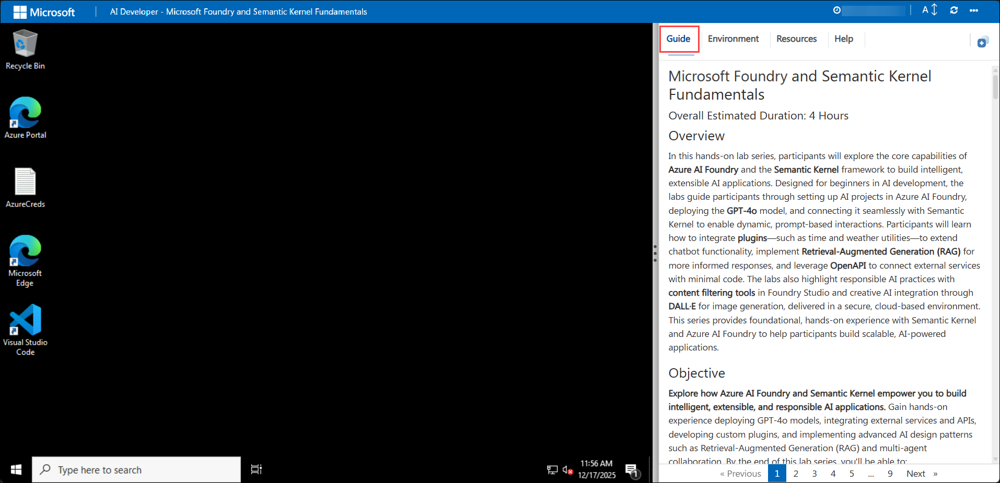
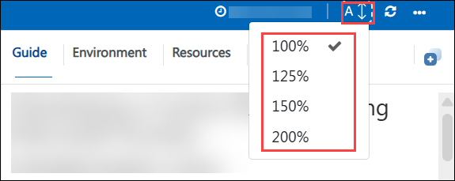
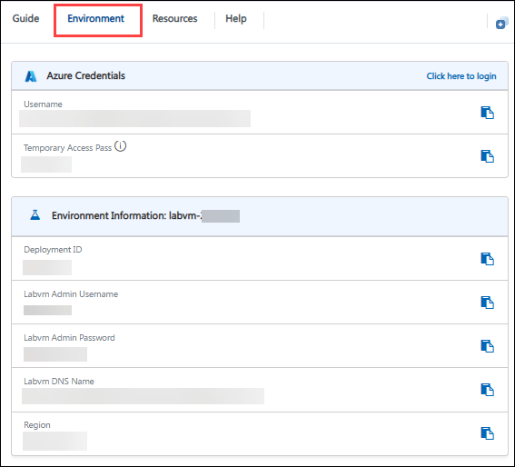
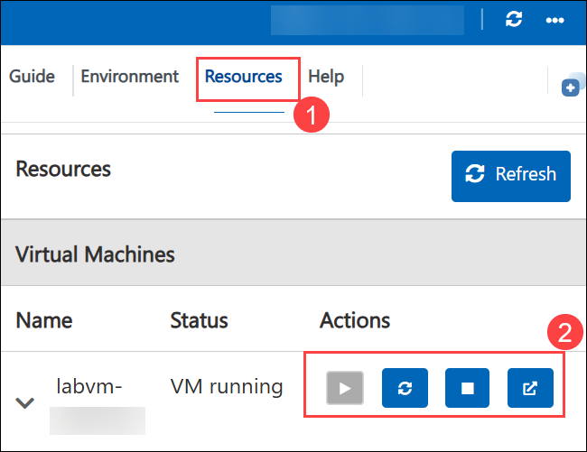
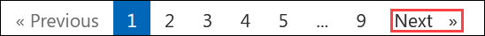

# Microsoft Foundry and Semantic Kernel Fundamentals

### Overall Estimated Duration: 4 Hours

## Lab Scenario

Contoso Innovations is building an AI-powered employee assistant using Microsoft Foundry and Semantic Kernel. As an AI Developer, your task is to enhance the chatbot by integrating Semantic Kernel plugins for time, geolocation, weather, and external OpenAPI services, enabling it to retrieve real-time information and perform intelligent function calling. You will also implement Retrieval-Augmented Generation (RAG) with Azure AI Search to help the assistant answer employee questions using organizational knowledge. By the end of the lab, you will have developed a more capable, context-aware AI assistant that combines LLM reasoning with external tools and enterprise data sources.

## Lab Overview

In this hands-on lab series, participants will explore the core capabilities of **Microsoft Foundry** and the **Semantic Kernel** framework to build intelligent, extensible AI applications. Designed for beginners in AI development, the labs guide participants through setting up AI projects in Microsoft Foundry, deploying the **GPT-4o** model, and connecting it seamlessly with Semantic Kernel to enable dynamic, prompt-based interactions. Participants will learn how to integrate **plugins**—such as time and weather utilities—to extend chatbot functionality, implement **Retrieval-Augmented Generation (RAG)** for more informed responses, and leverage **OpenAPI** to connect external services with minimal code. The labs also highlight responsible AI practices with **content filtering tools** in Foundry Studio, delivered in a secure, cloud-based environment. This series provides foundational, hands-on experience with Semantic Kernel and Microsoft Foundry to help participants build scalable, AI-powered applications.

## Objectives

**Explore how Microsoft Foundry and Semantic Kernel empower you to build intelligent, extensible, and responsible AI applications.** Gain hands-on experience deploying GPT-4o models, integrating external services and APIs, developing custom plugins, and implementing advanced AI design patterns such as Retrieval-Augmented Generation (RAG) and multi-agent collaboration. By the end of this lab series, you'll be able to:

- **Microsoft Foundry Fundamentals**: Learn how to create, manage, and deploy AI projects using Microsoft Foundry and GPT-4o.
- **Semantic Kernel Fundamentals**: Build an intelligent chat experience by connecting Semantic Kernel with GPT-4o through a simple starter app.
- **Semantic Kernel Plugins**: Extend your chatbot’s capabilities by building and integrating custom Semantic Kernel plugins.
- **Import Plugin using OpenAPI**: Seamlessly integrate external APIs into Semantic Kernel using OpenAPI specifications.
- **Retrieval-Augmented Generation (RAG)**: Enhance AI responses by combining external knowledge retrieval with generative models using the RAG pattern.
- **Responsible AI: Exploring Content Filters in Microsoft Foundry**: Apply content filtering tools to build safer, more accountable AI applications within Microsoft Foundry.
- **Multi-Agent Systems**: Coordinate multiple AI agents within Semantic Kernel to solve complex tasks through collaboration.

## Pre-requisites

- Basic knowledge of Azure
- Familiarity with AI concepts, such as language models and embeddings
- Basic understanding of REST APIs and JSON data formats
- Familiarity with Semantic Kernel concepts such as plugins, planners, and AI skills
- Basic experience using resource management
- (Optional) Familiarity with OpenAPI specifications for plugin integration
- (Optional) Understanding of Retrieval-Augmented Generation (RAG) patterns for AI applications

## Architecture
In this hands-on lab, participants will explore **Microsoft Foundry** and **Semantic Kernel** to build, deploy, and extend AI-powered applications. The journey begins with the **Azure Portal**, where they will access and manage AI services. They will deploy **GPT-4o** models using **Models + Endpoints**, enabling real-time AI interactions. To enhance response accuracy, participants will implement **Retrieval-Augmented Generation (RAG)** using **Azure AI Search**, ensuring contextually informed outputs.  

The lab also covers **plugins**, such as **Time & Weather utilities** for real-time data retrieval and **OpenAPI integration** to connect external services seamlessly. Participants will explore **content filtering** within Microsoft Foundry, applying built-in safety measures to ensure responsible AI usage. By the end of the lab, participants will have the foundational skills to develop scalable, secure, and extensible AI solutions using Azure’s powerful AI ecosystem.

## Architecture Diagram

## Explanation of Components

- **Microsoft Foundry**: Provides an integrated environment for AI model development, deployment, and management.  
- **Azure AI Studio**: A web-based interface for managing AI models, endpoints, and inference capabilities.  
- **Models + Endpoints**: Used for deploying and managing **GPT-4o** models for real-time AI interactions.  
- **Semantic Kernel**: An AI orchestration framework that connects **LLMs, plugins, and APIs** for enhanced AI capabilities.
- **OpenAPI**: Facilitates seamless integration with external APIs for AI-driven workflows.  
- **Azure AI Search**: Enhances **Retrieval-Augmented Generation (RAG)** by fetching relevant contextual data.  
- **Azure Blob Storage**: Stores indexed documents, datasets, and knowledge bases for AI-powered insights.  
- **Azure AI Content Safety**: Provides content filtering and moderation tools to ensure responsible AI usage.   
- **Visual Studio Code (VS Code)**: Development environment for AI application coding, debugging, and testing.    
- **Python SDKs & REST APIs**: Used to interact with **Microsoft Foundry, Semantic Kernel, and OpenAI services**.

## Getting Started with the Lab

Welcome to your AI Developer - Microsoft Foundry and Semantic Kernel Fundamentals Workshop! We've prepared a seamless environment for you to explore and learn about Azure services. Let's begin by making the most of this experience:

## Accessing Your Lab Environment
 
Once you're ready to dive in, your virtual machine and lab guide will be right at your fingertips within your web browser.

   

## Lab Guide Zoom In/Zoom Out

To adjust the zoom level for the environment page, click the A↕: 100% icon located next to the timer in the lab environment. 

   

## Virtual Machine & Lab Guide
 
Your virtual machine is your workhorse throughout the workshop. The lab guide is your roadmap to success.
 
## Exploring Your Lab Resources
 
To get a better understanding of your lab resources and credentials, navigate to the **Environment** tab.
 
   
 
## Utilizing the Split Window Feature
 
For convenience, you can open the lab guide in a separate window by selecting the **Split Window** button from the Top right corner.
 
 
 
## Managing Your Virtual Machine
 
Feel free to **Start, Stop, or Restart (2)** your virtual machine as needed from the **Resources (1)** tab. Your experience is in your hands!
 

## Let's Get Started with Azure Portal

1. On your **Lab VM**, click on the **Azure Portal** icon as shown below:

   .png)
   
1. On the Sign in to Microsoft Azure tab, you will see the login screen. Enter the following email/username, and click on **Next (2)**:
 
   - **Email/Username:** <inject key="AzureAdUserEmail"></inject> **(1)**
 
     
 
1. Now enter the following temporary password and click on **Sign in (2)**.
 
   - **Temporary Access Pass:** <inject key="AzureAdUserPassword"></inject> **(1)**
 
      

1. If you see the pop-up **Stay-Signed in?**, click **No**.

    

1. If a **Welcome to Microsoft Azure** pop-up window appears, simply click **Maybe later** to skip the tour.

   

<!--- MFA Setup Steps 
1. If an **Action required** pop-up window appears, click on **Next**.

   

1. On **Start by getting the app** page, click on **Next**.

1. Click on **Next** twice.

1. In **Android**, go to the Play Store, search for **Microsoft Authenticator,** and tap on **Install**.

   

   >Note: For **iOS**, open the App Store and repeat the steps.

   >Note: Skip If already installed.
   
1. Open the app and click on **Scan a QR code**.
1. Scan the **QR code (1)** visible on the screen and click on **Next (2)**.

   
1. Enter the digit displayed on the screen in the Authenticator app on mobile and tap on **Yes**.
1. Once the notification is approved, click on **Next (1)**.

   
1. Click on **Done**.
1. If prompted to stay signed in, you can click **"Yes."**

1. Tap on **Finish** in the mobile device.

   >NOTE: While logging in again, enter the digits displayed on the screen in the **Authenticator app** and click on Yes.
-->

## Support Contact

The CloudLabs support team is available 24/7, 365 days a year, via email and live chat to ensure seamless assistance anytime. We offer dedicated support channels tailored specifically for learners and instructors, ensuring that all your needs are promptly and efficiently addressed.

Learner Support Contacts:

- Email Support: cloudlabs-support@spektrasystems.com
- Live Chat Support: https://cloudlabs.ai/labs-support

Now, click **Next >>** from the bottom right corner to embark on your Lab journey!

## Happy Learning!!
