# Exercise 2: Semantic Kernel Fundamentals
 
### Estimated Duration: 25 Minutes
 
## Scenario

Contoso Innovations wants to enhance its AI assistant by integrating Semantic Kernel to enable intelligent orchestration between AI models and application logic. As an AI Developer, you will build a chat application, connect it to Microsoft Foundry models, and implement Semantic Kernel capabilities such as prompt execution and function calling. 

## Overview

In this exercise, you will gain hands-on experience building an intelligent chat feature using the **Semantic Kernel** framework integrated with the **Microsoft Foundry GPT-4o** model. You will set up the development environment, configure necessary credentials, and implement a chat API that sends user prompts to the GPT-4o model via Semantic Kernel, returning dynamic AI-generated responses within a starter application.

 
## Objectives

In this exercise, you will complete the following tasks:

- Task 1: Set up environment variables

- Task 2: Update the code files and run the app.
 
## Task 1: Set up environment variables
 
In this task, you will explore different flow types in Microsoft Foundry by setting up Visual Studio Code, retrieving Azure OpenAI credentials, and configuring them in Python and C Sharp (C#) environments.
 
1. In the **Lab VM**, open **Visual Studio Code** from the desktop.

    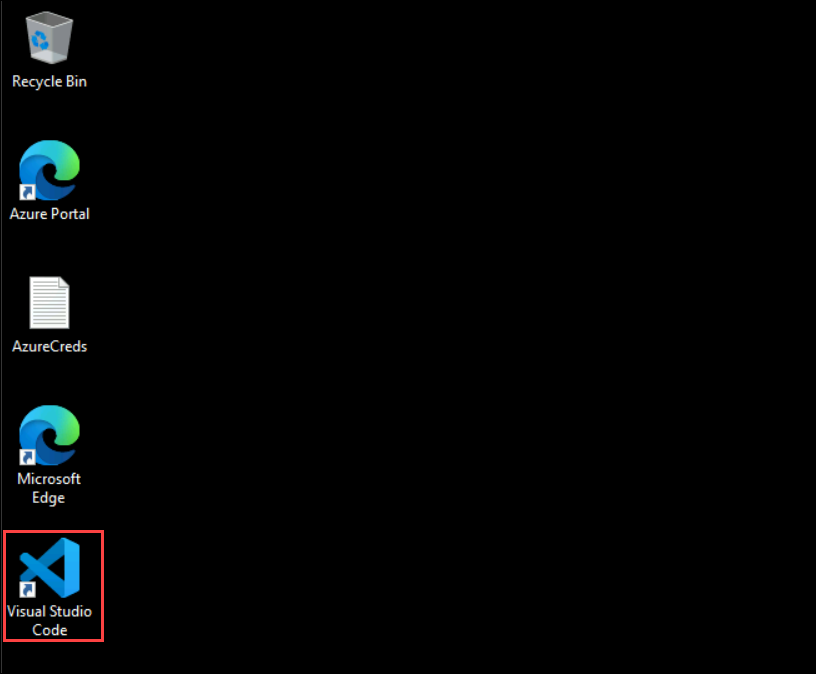

1. Click on **File (1)** and select **Open Folder... (2)**.

    
    
1. Navigate to `C:\LabFiles` (1), select the **ai-developer (2)** folder, and click **Select Folder (3)**.

    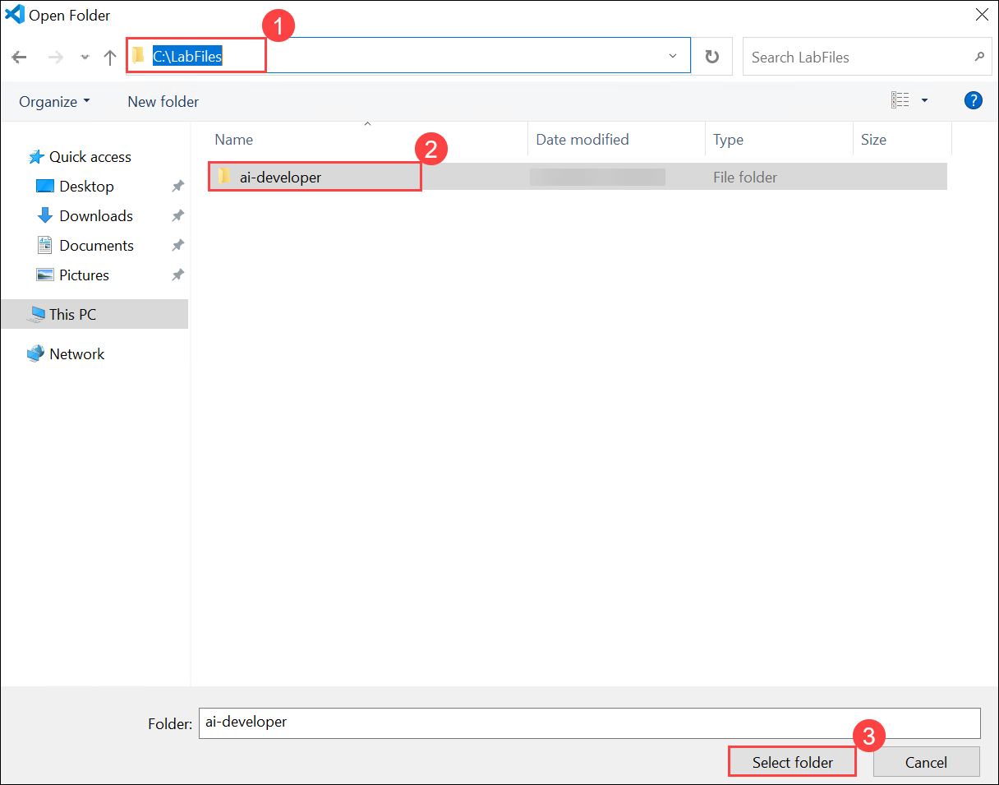

1. Click **Yes, I trust the authors** to trust the folder and enable all features.

    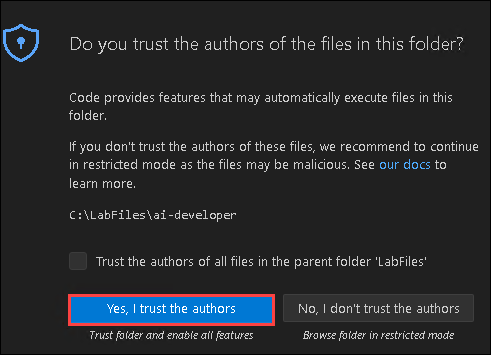

    >**Note:** If a pop-up window opens asking for Github Copilot chat wants to sign in, click on **Cancel**.

1. Navigate back to **Microsoft Foundry** portal and click on **Overview (1)** and select **Go to Foundry Portal (2)**.

    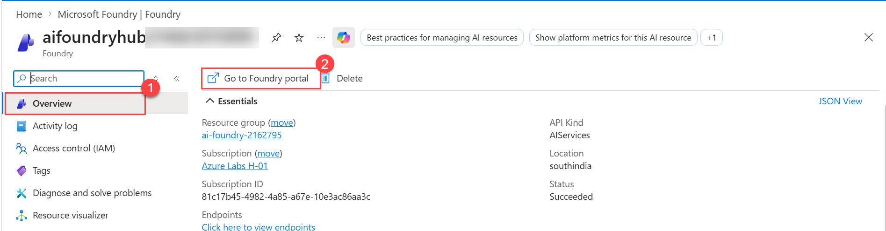

1. From the **Overview (1)** page, select **Azure OpenAI (2)** under Libraries, copy the **API Key (3)** and copy the **Azure OpenAI endpoint (4)** using the copy icons and paste it into **Notepad** as this is to be used in the upcoming exercises.

    >**Note**: If the Azure OpenAI resource is deployed in a different region because the **gpt-4o** model is unavailable in the specified region, use the **Azure OpenAI Endpoint** and **API Key** from the deployed resource. For reference, see Exercise 1, Task 1, Step 3.

    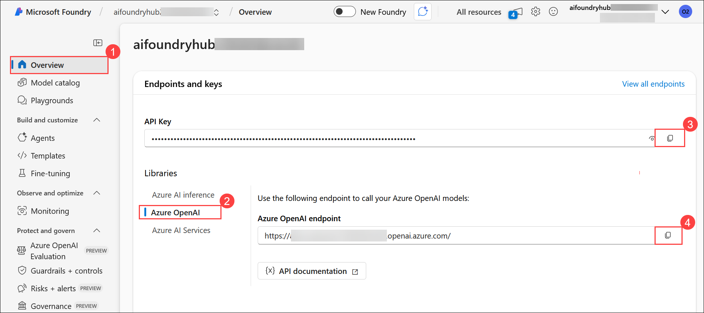

1. Perform the further steps based on your preferred programming language:

<details>
<summary><strong>Python</strong></summary>

1. In VS Code, expand **Python** **(1)** folder, then expand **src** **(2)** directory and open **.env** (3) file.

    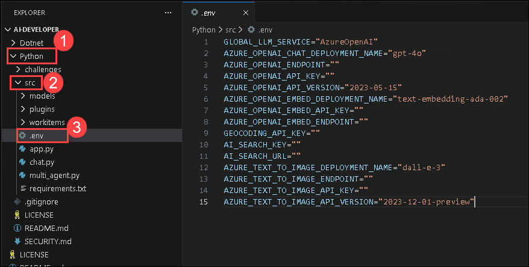

1. Paste **Azure OpenAI Service endpoint** copied earlier in the exercise next to `AZURE_OPENAI_ENDPOINT`.
    >Note:- Ensure that every value in the **.env** file is enclosed in **double quotes ("")**.
1. Paste **API key** copied earlier in the exercise next to `AZURE_OPENAI_API_KEY`.

    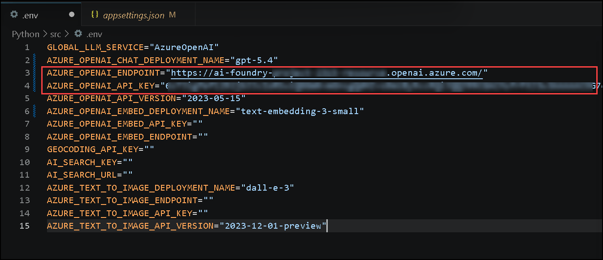

1. Use **Ctrl+S** to save the file.

</details>

<details>
<summary><strong>C Sharp(C#)</strong></summary>

1. In VS Code, navigate to `Dotnet>src>BlazorAI` directory and open **appsettings.json** file.

    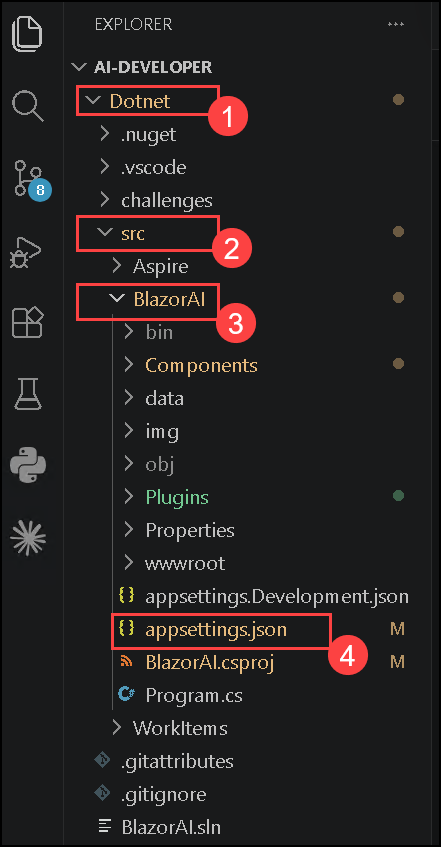

1. Paste **Azure OpenAI Service endpoint** copied earlier to the exercise besides `AOI_ENDPOINT`.

    >**Note**:- Ensure that every value in the **appsettings.json** file is enclosed in **double quotes ("")**.

    >**Note**:- Make sure to remove the "/" from the endpoint.

1. Paste **API key** copied earlier in the exercise besides `AOI_API_KEY`.

    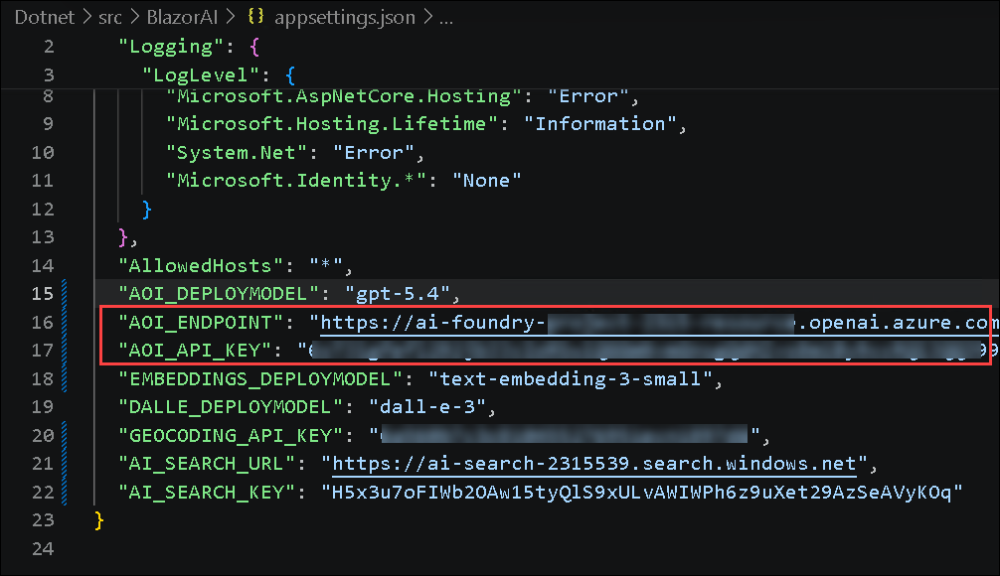

1. Use **Ctrl+S** to save the file.

</details>

## Task 2: Update the code files and run the app

In this task, you will explore different flow types in Microsoft Foundry by updating code files, running the AI-powered app in Python or C#, and testing responses to user prompts.

>**Note:** Perform the further steps based on your preferred programming language:

<details>
<summary><strong>Python</strong></summary>

1. Navigate to `Python>src` directory and open **chat.py** file.

    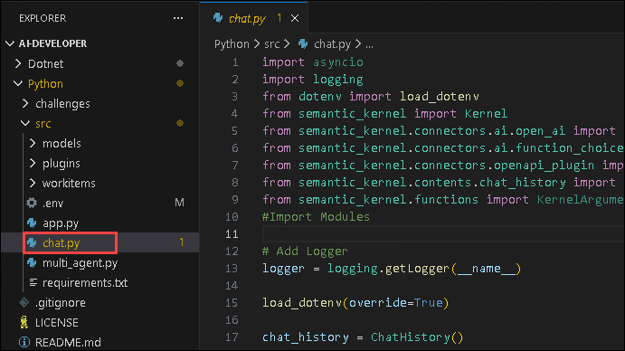

1. Add the following code in the `#Import Modules` (1) section of the file.

    ```
    from semantic_kernel.connectors.ai.chat_completion_client_base import ChatCompletionClientBase
    from semantic_kernel.connectors.ai.open_ai import OpenAIChatPromptExecutionSettings
    import os
    ```

    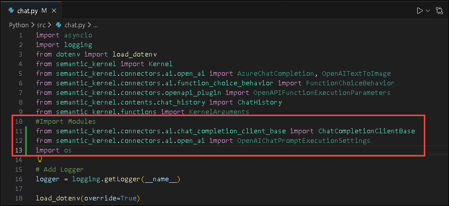

1. Add the following code in the `# Challenge 02 - Chat Completion Service` (1) section of the file.

    ```
        chat_completion_service = AzureChatCompletion(
            deployment_name=os.getenv("AZURE_OPENAI_CHAT_DEPLOYMENT_NAME"),
            api_key=os.getenv("AZURE_OPENAI_API_KEY"),
            endpoint=os.getenv("AZURE_OPENAI_ENDPOINT"),
            service_id="chat-service",
        )
        kernel.add_service(chat_completion_service)
        execution_settings = kernel.get_prompt_execution_settings_from_service_id("chat-service")
    ```

    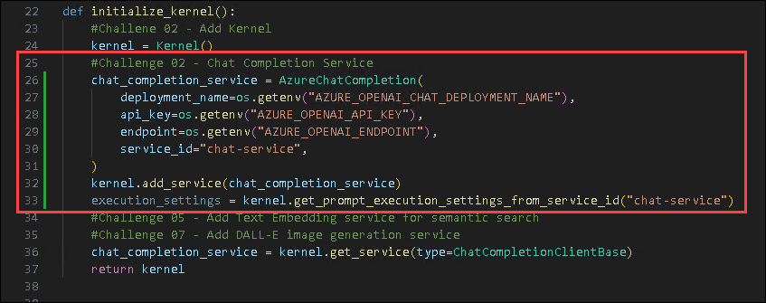

1. Add the following code in the `# Start Challenge 02 - Sending a message to the chat completion service by invoking kernel` section of the file.

    ```
        # Start Challenge 02 - Sending a message to the chat completion service by invoking kernel
        global chat_history
        chat_history.add_user_message(user_input)
        chat_completion = kernel.get_service(type=ChatCompletionClientBase)
        execution_settings = kernel.get_prompt_execution_settings_from_service_id("chat-service")
        response = await chat_completion.get_chat_message_content(
            chat_history=chat_history,
            settings=execution_settings,
            kernel=kernel
        )
        chat_history.add_assistant_message(str(response))
    ```

    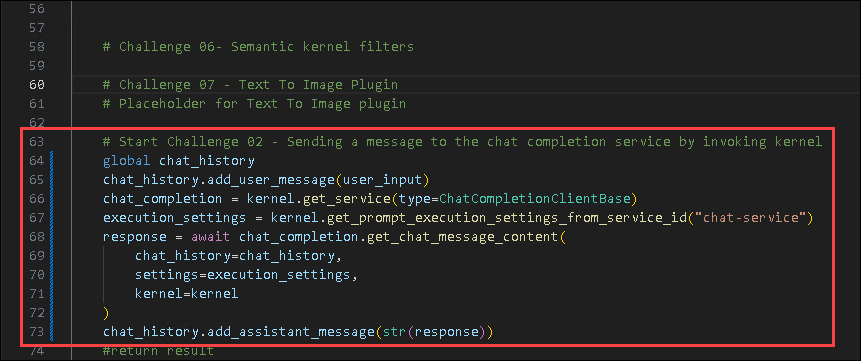

1. Add the following code in the `#return result` section of the file.

    ```
        logger.info(f"Response: {response}")
        return response
    ```

    

1. In case you encounter any indentation error, use the code from the following URL:

    ```
    https://raw.githubusercontent.com/CloudLabsAI-Azure/ai-developer/refs/heads/prod/CodeBase/python/lab-02.py
    ```

1. Save the file.

1. Right click on **src (1)** in the left pane and select **Open in Integrated Terminal (2)**.

    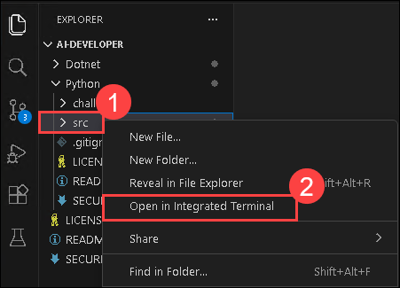

1. Use the following command to run the app:

    ```
    streamlit run app.py
    ```

1. If you are asked for any email to register, feel free to use the email provided below, and hit **Enter**. This will automatically open the app in the browser.

    ```
    test@gmail.com
    ```

    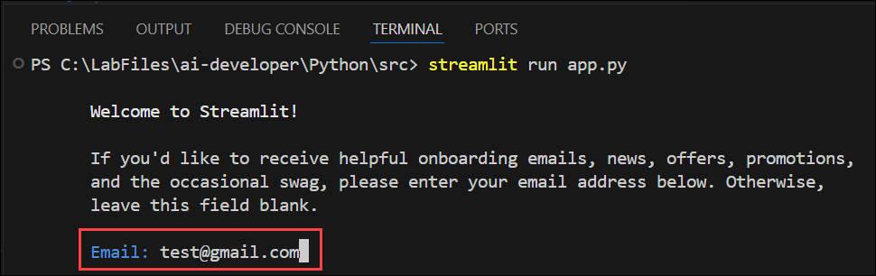

1. If the app does not open automatically in the browser, you can access it using the following **URL**:

    ```
    http://localhost:8501
    ```

1. Submit the following prompt and see how the AI responds:

    ```
    Why is the sky blue?
    ```

    ```
    Why is it red?
    ```

1. You will receive a response similar to the one shown below:

    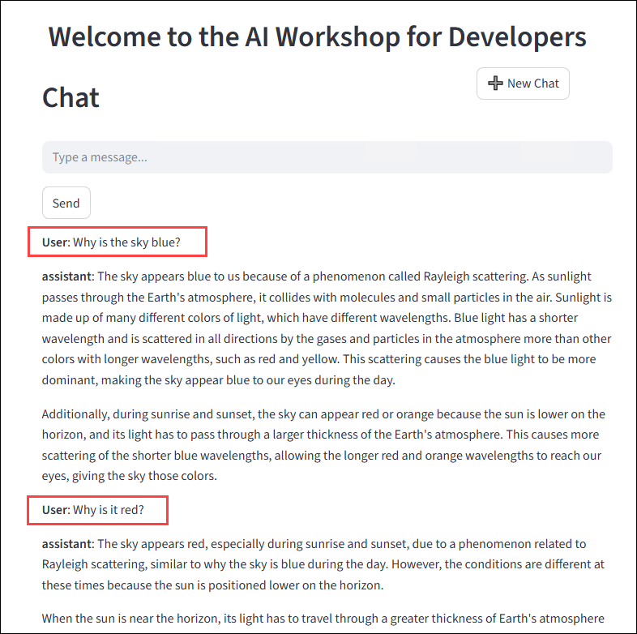

</details>

<details>
<summary><strong>C Sharp(C#)</strong></summary>

1. Navigate to `Dotnet > src > BlazorAI > Components > Pages` directory and open **Chat.razor.cs** file.

    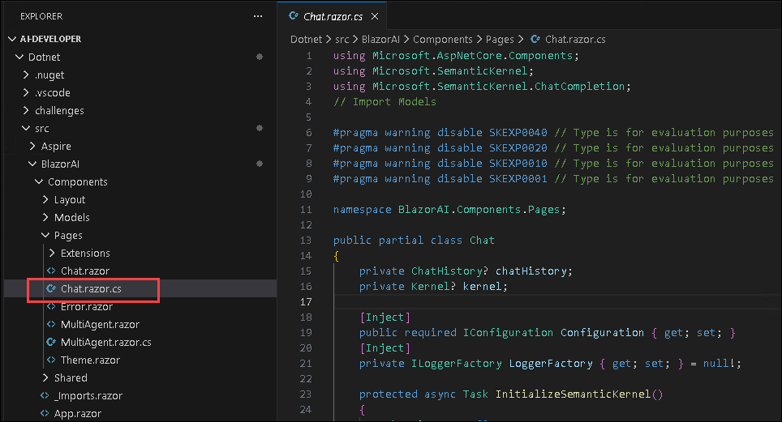

1. Add the following code in the `// Your code goes here` in the **Line no. 92** section of the file.

    ```
    chatHistory.AddUserMessage(userMessage);
    var chatCompletionService = kernel.GetRequiredService<IChatCompletionService>();
    var assistantResponse = await chatCompletionService.GetChatMessageContentAsync(
        chatHistory: chatHistory,
        kernel: kernel);
    chatHistory.AddAssistantMessage(assistantResponse.Content);
    ```

    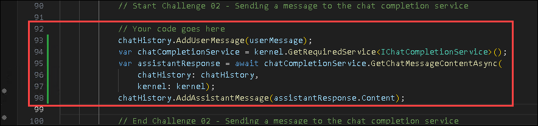
    
1. In case you encounter any indentation error, use the code from the following URL: 

    ```
    https://raw.githubusercontent.com/CloudLabsAI-Azure/ai-developer/refs/heads/prod/CodeBase/c%23/lab-02.cs
    ```

1. Use **Ctrl+S** to save the file.

1. Right click on `Dotnet>src>Aspire>Aspire.AppHost` **(1)** in the left pane and select **Open in Integrated Terminal (2)**.

    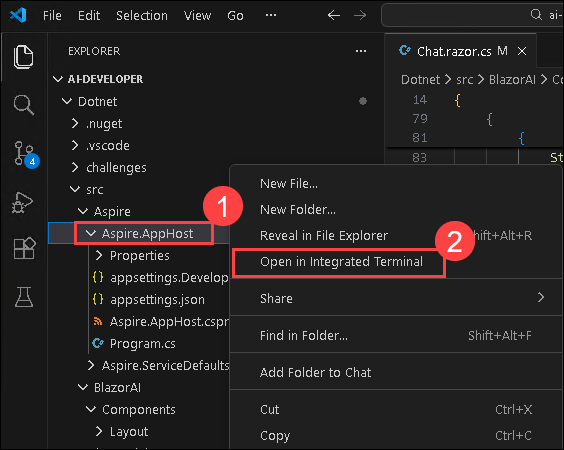

1. Run the following command to trust the dev certificates necessary to run the app locally, and then select **Yes**:

    ```
    dotnet dev-certs https --trust
    ```

    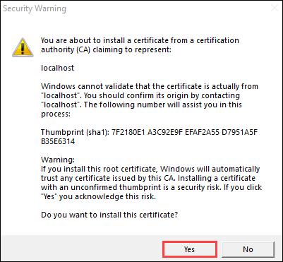

1. Use the following command to run the app:

    ```
    dotnet run
    ```
    
1. Open a new tab in the browser and navigate to the below link for **blazor-aichat**

    ```
    https://localhost:7118/
    ```

    >**Note**: If you receive security warnings in the browser, close the browser and follow the link again.

1. Submit the following prompt and see how the AI responds:

    ```
    Why is the sky blue?
    ```

    ```
    Why is it red?
    ```
    
1. You will receive a response similar to the one shown below:

    

1. Once you receive the response, navigate back to the Visual studio code terminal and then press **Ctrl+C** to stop the build process.

</details>

## Summary

In this exercise, you have completed the following:

- Set up the required environment variables.

- Updated the code files and successfully ran the application.

### You have successfully completed this exercise. Kindly click **Next >>** to proceed further


