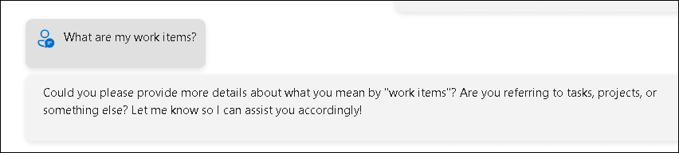
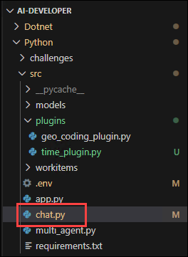
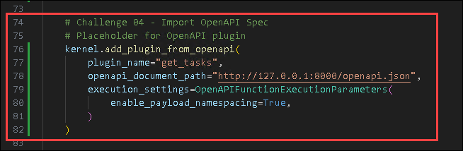
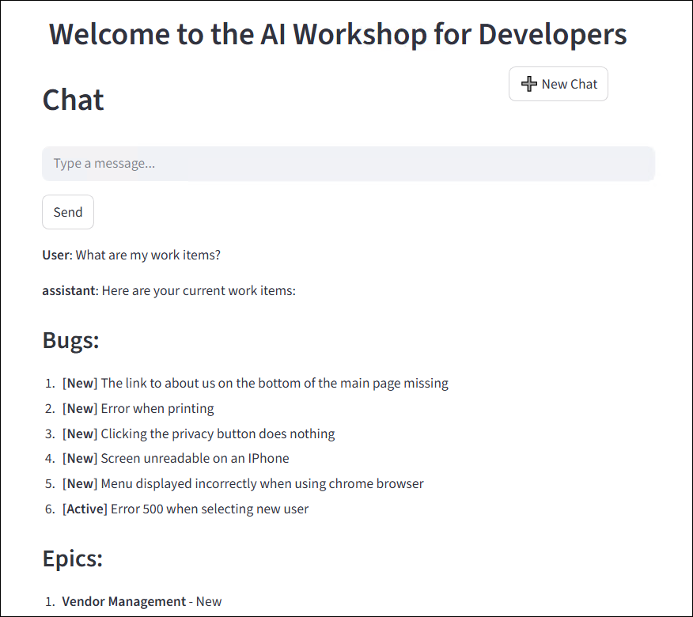
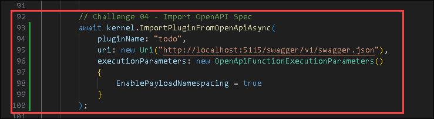

# Exercise 4: Import Plugin using OpenAPI

### Estimated Duration: 25 Minutes

## Overview

In this exercise, you will explore the integration of OpenAPI with Semantic Kernel to enhance AI-driven applications. Designed for developers new to API orchestration, the lab guides you through leveraging OpenAPI specifications to load external services as plugins dynamically. You will learn to import the provided WorkItems API as an OpenAPI plugin, enabling seamless interaction through AI-driven prompts. By the end of this lab, you will understand how OpenAPI simplifies API integration, reduces manual coding, and enhances the automation of external service calls.

## Objectives

In this exercise, you will complete the following tasks:

- Task 1: Try the app without the OpenAPI Plugin

- Task 2: Create and import the OpenAPI Plugin

## Task 1: Try the app without the OpenAPI Plugin

In this task, you will explore different flow types in Microsoft Foundry by running the app without the OpenAPI Plugin to observe its default behavior.

1. Launch your AI Chat app in any of your preferred languages, and submit the following prompt and see how it responds:

    ```
    What are my work items?
    ```
1. You will receive a response similar to the one shown below, stating that it cannot access the work items:

    

## Task 2: Create and import the OpenAPI Plugin

In this task, you will explore different flow types in Microsoft Foundry by creating and importing the OpenAPI Plugin to extend the app's capabilities.

<details>
<summary><strong>Python</strong></summary>

1. Right click on `Python>src>workitems` **(1)** in the left pane and select **Open in Integrated Terminal (2)**.

    

1. Use the following command to run the app:
    ```
    python api.py
    ```
    >**Note**:- Please don't close the `terminal`.

1. Open the following link in a new browser tab to review the OpenAPI spec: 
    ```
    http://127.0.0.1:8000/openapi.json
    ```

    

1. Open the following link in another browser tab to go to the Swagger page for the API: 
    ```
    http://127.0.0.1:8000/docs
    ```

    

1. Navigate to `Python>src` directory and open **chat.py** file.

    

1. Add the following code in the `# Placeholder for OpenAPI plugin` section of the file.
    ```
    kernel.add_plugin_from_openapi(
        plugin_name="get_tasks",
        openapi_document_path="http://127.0.0.1:8000/openapi.json",
        execution_settings=OpenAPIFunctionExecutionParameters(
            enable_payload_namespacing=True,
        )
    )
    ```

    

     >**Note**: Please refer the screenshots to locate the code in proper position that helps you to avoid indentation error.

1. In case you encounter any indentation error, use the code from the following URL:
    ```
    https://raw.githubusercontent.com/CloudLabsAI-Azure/ai-developer/refs/heads/prod/CodeBase/python/lab-04.py
    ```
1. Save the file.

1. Right-click on `Python>src` **(1)** in the left pane and select **Open in Integrated Terminal (2)**.

    

1. Use the following command to run the app:
    ```
    streamlit run app.py
    ```
1. If the app does not open automatically in the browser, you can access it using the following **URL**:

    ```
    http://localhost:8501
    ```
1. Submit the following prompt and see how the AI responds:
    ```
    What are my work items?
    ```
1. You will receive a response similar to the one shown below:

    

</details>

<details>
<summary><strong>C Sharp(C#)</strong></summary>

1. Right click on `Dotnet>src>Aspire>Aspire.AppHost` **(1)** in the left pane and select **Open in Integrated Terminal (2)**.

    

1. Use the following command to run the app:
    ```
    dotnet run
    ```

1. You can review the OpenAPI spec in the following path:
    ```
    http://localhost:5115/swagger/v1/swagger.json
    ```
    

1. The swagger page can be found in the below link 
    ```
    http://localhost:5115/swagger/index.html
    ```
    

1. Navigate to `Dotnet>src>BlazorAI>Components>Pages` directory and open **Chat.razor.cs** file.

    

1. Add the following code in the `// Import Models` section of the file.
    ```
    using Microsoft.SemanticKernel.Plugins.OpenApi;
    ```

    

1. Add the following code in the `// Challenge 04 - Import OpenAPI Spec` (1) section of the file.
    ```
    await kernel.ImportPluginFromOpenApiAsync(
        pluginName: "todo",
        uri: new Uri("http://localhost:5115/swagger/v1/swagger.json"),
        executionParameters: new OpenApiFunctionExecutionParameters()
        {
            EnablePayloadNamespacing = true
        }
    );
    ```

    

     >**Note**: Please refer the screenshots to locate the code in proper position that helps you to avoid indentation error.

1. In case you encounter any indentation error, use the code from the following URL:
    ```
    https://raw.githubusercontent.com/CloudLabsAI-Azure/ai-developer/refs/heads/prod/CodeBase/c%23/lab-04.cs
    ```
1. Save the file.

1. Right click on `Dotnet>src>Aspire>Aspire.AppHost` **(1)** in the left pane and select **Open in Integrated Terminal (2)**.

    

1. Use the following command to run the app:
    ```
    dotnet run
    ```
1. Open a new tab in the browser and navigate to the below link for **blazor-aichat**

    ```
    https://localhost:7118/
    ```

    >**Note**: If you receive security warnings in the browser, close the browser and follow the link again.

1. Submit the following prompt and see how the AI responds:
    ```
    What are my work items?
    ```
1. You will receive a response similar to the one shown below:

    

1. Once you receive the response, navigate back to the Visual Studio code terminal and then press **Ctrl+C** to stop the build process.

</details>

## Summary

In this exercise, you have completed the following:

- Tested the application without the OpenAPI Plugin.

- Created and imported the OpenAPI Plugin.

### You have successfully completed this exercise. Kindly click **Next >>** to proceed further


