# Exercise 5: Retrieval-Augmented Generation (RAG)

### Estimated Duration: 40 Minutes

This hands-on lab introduces you to the Retrieval-Augmented Generation (RAG) pattern—an AI architecture that enhances response quality by integrating relevant external knowledge into the generative process. Designed for those new to RAG, the lab guides you through how retrieval mechanisms work alongside generative models to deliver more accurate, informed, and context-aware outputs. You will also gain a clear understanding of data privacy and security prompts, completions, embeddings, and training data remaining fully isolated—they are not shared with other customers, OpenAI, Microsoft, or third parties, nor are they used to improve models automatically.

## Objectives
In this exercise, you will be performing the following tasks:
- Task 1: Deploy a Text Embedding model
- Task 2: Create a Semantic Search Plugin to query the AI Search Index

## Task 1: Deploy a Text Embedding model

In this task, you will explore different flow types in Azure AI Foundry by deploying a Text Embedding model to enable text representation and similarity analysis.

1. In your browser window in Lab VM, Navigate to the Microsoft Foundry portal.

1. From the left navigation pane, select **Models (1)**, then click **Deploy a base model (2)**

    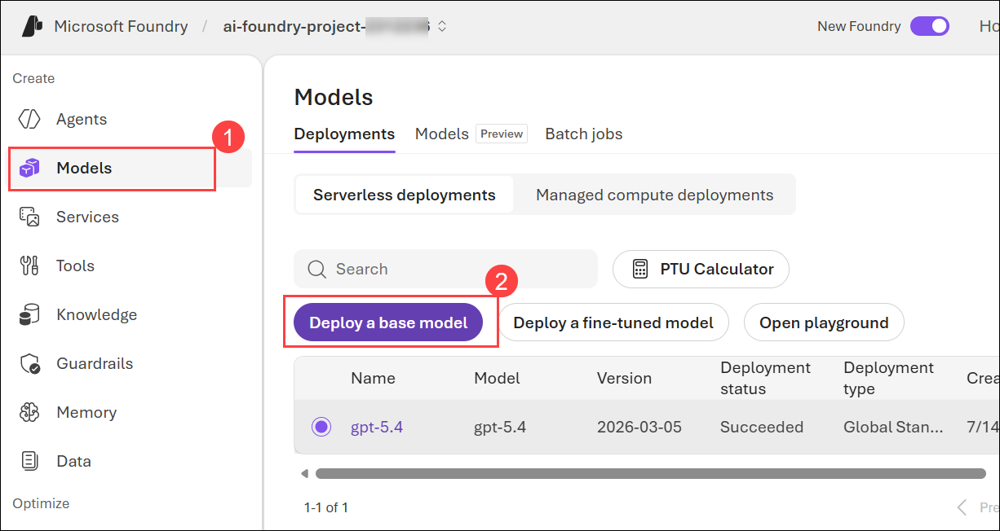

1. Search for **text-embedding-3-small (1)**, and select the model **(2)**.

    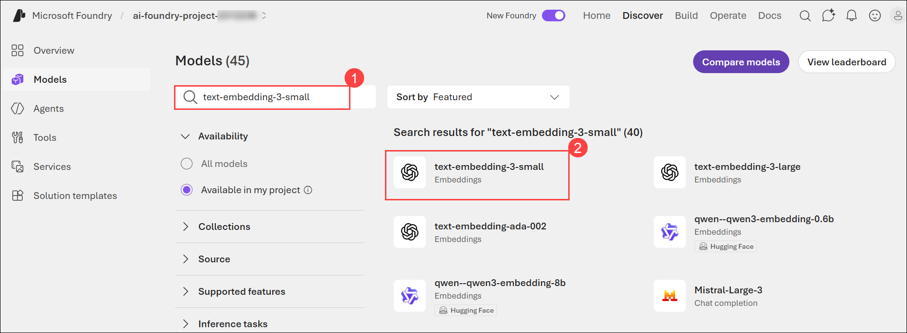

1. Click on **Deploy (1)**, and select **Default settings (2)**.

    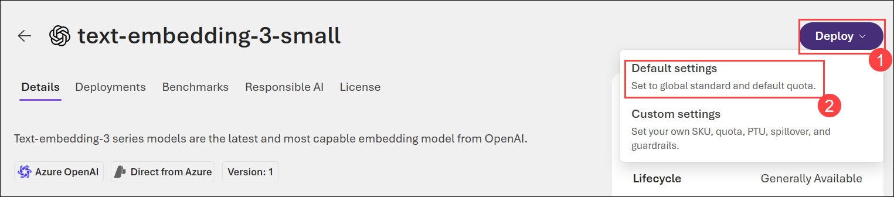

1. Navigate back to **Models**, select **GPT-5.4**.

    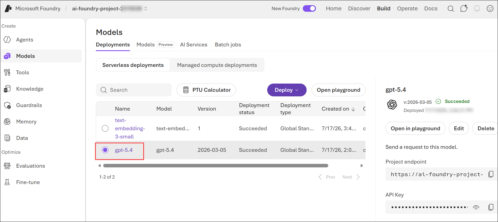

1. On the details screen of gpt-5.4, click **Save as agent**.

    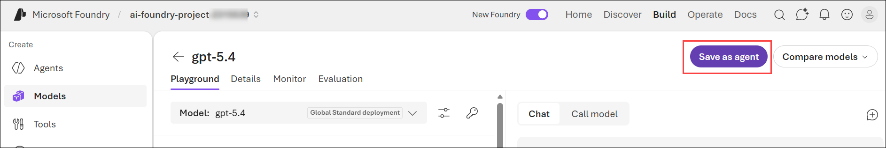

1. Create an agent pop up appears, enter the agent name as **gpt (1)** and click **create and open playground (2)**.
    
    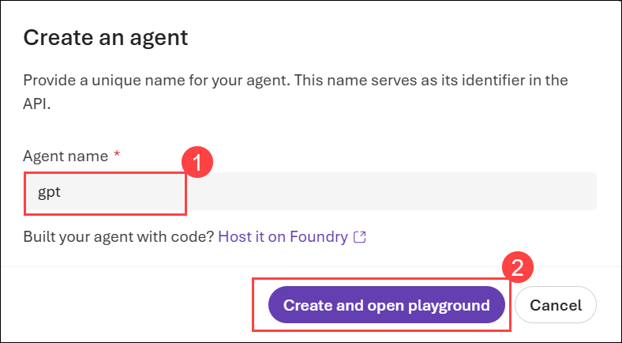

1. On the playground screen, scroll down and click **add (1)** on the knowledge section, then click **Connect to Foundy IQ (2)**.

    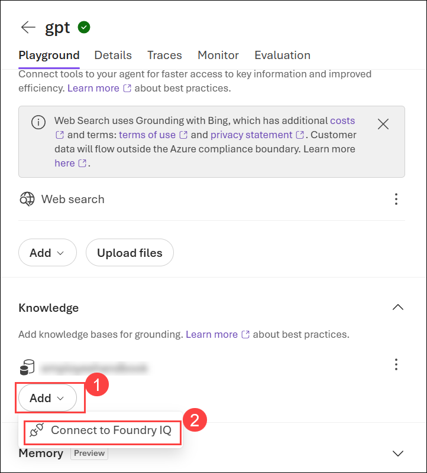

1. On Connect to Foundry IQ pop-up, select Connection as **ai-search-<inject key="Deployment ID" enableCopy="false"></inject>** and on knowledge base click **Create a new base in ai-search-<inject key="Deployment ID" enableCopy="false"></inject>**.

    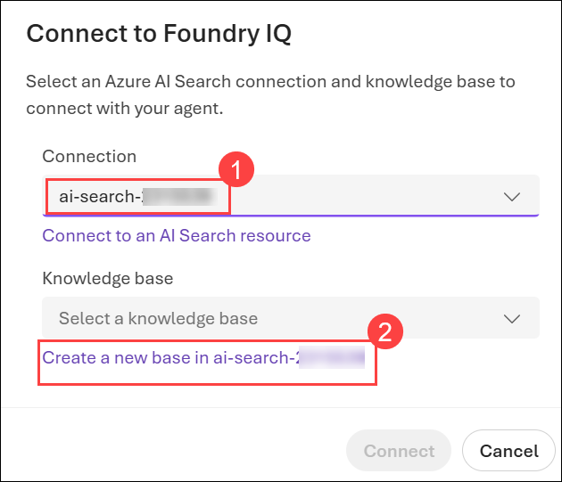

1. On Create a new knowledge base screen,  enter name as **kb-<inject key="Deployment ID" enableCopy="false"></inject> (1)** and select the chat completion model is **gpt-5.4 (2)**, and select **upload files (3)**.
  
    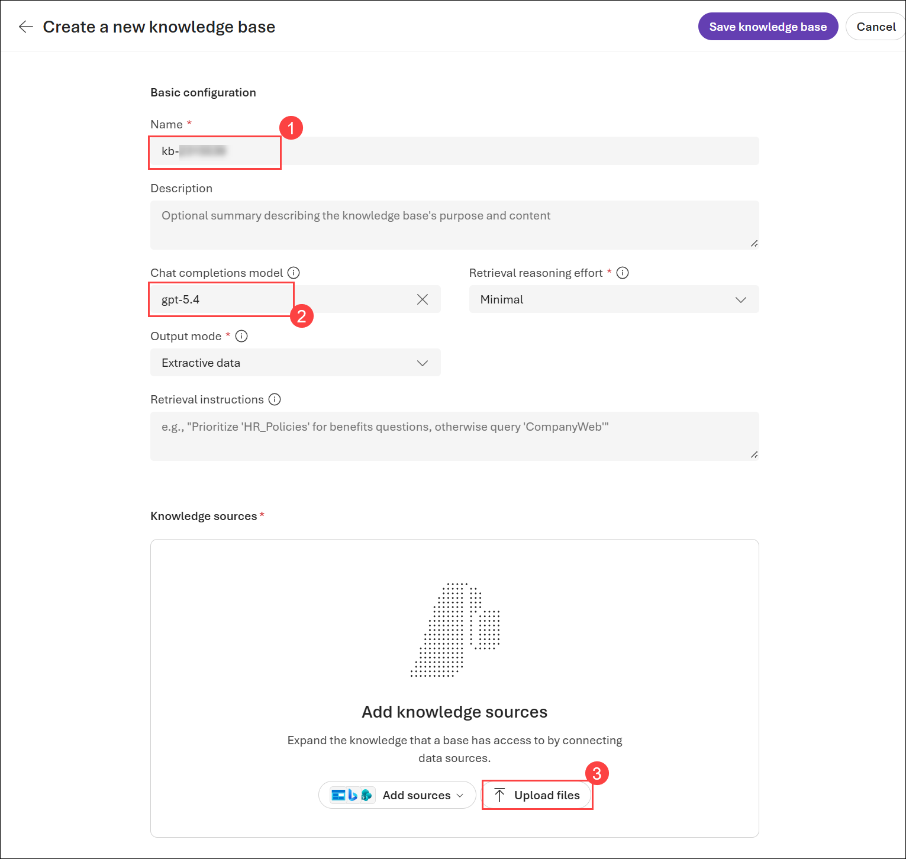

1. Navigate to `C:\LabFiles\ai-developer\Dotnet\src\BlazorAI\data\` (1) and select employee_handbook.pdf (2). Click on Open (3).

    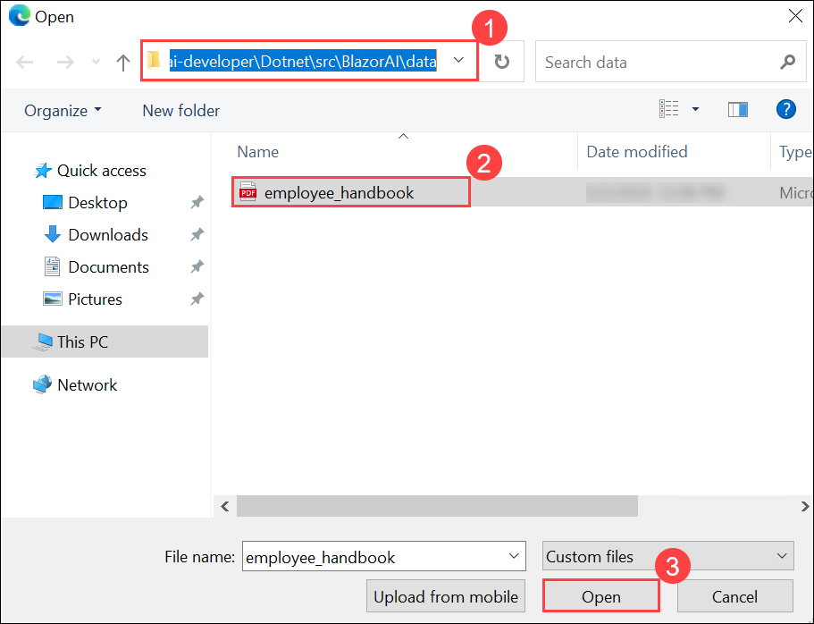

1. On Create a knowledge source screen, enter name as **ks-file-<inject key="Deployment ID" enableCopy="false"></inject> (1)**, verify the embedding model as **text-embedding-3-small (2)**, and click **create (3)**.

    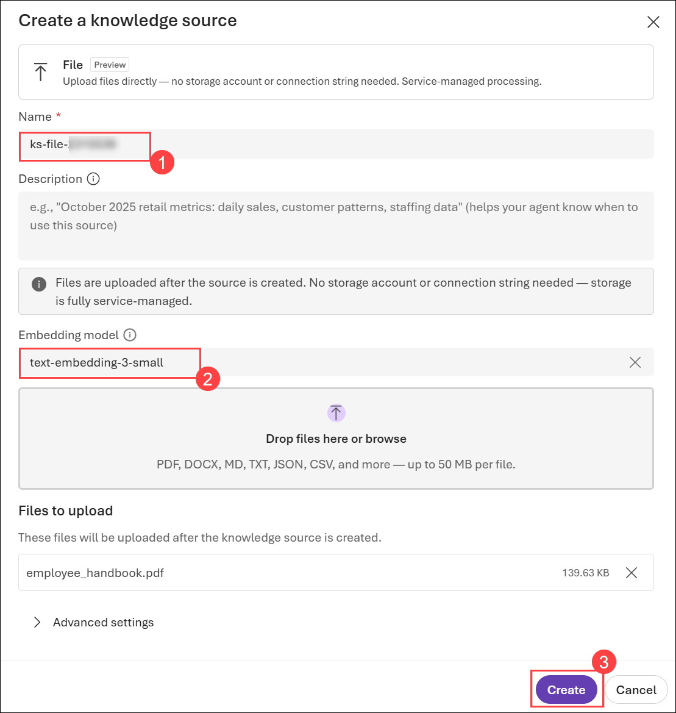

1. Wait for 1-2 minutes until file uploading completes.

1. Once the status of the file is **active(1)**, click on **Save knowledge base (2)**.

    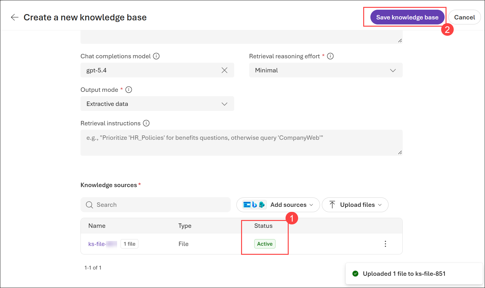

1. Once changes are saved, click **Use in an agent (1)** tab and select your **agent (2)**.

    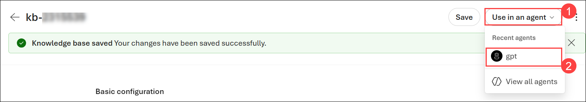

1. Navigate to the **Azure Portal** and search **AI Search (1).** Click on it and open the **AI Search (2)** resource located there.

    

1. Select **ai-search-<inject key="Deployment ID" enableCopy="false"></inject>**.    
    
    

1. On the **Overview (1)** page, copy the **URL (2)** and paste it into Notepad.

    

1. Navigate to **Keys (1)** under **Security + networking** in the left pane, copy the **Primary admin key (2)** from Azure Portal, and paste it into Notepad.

    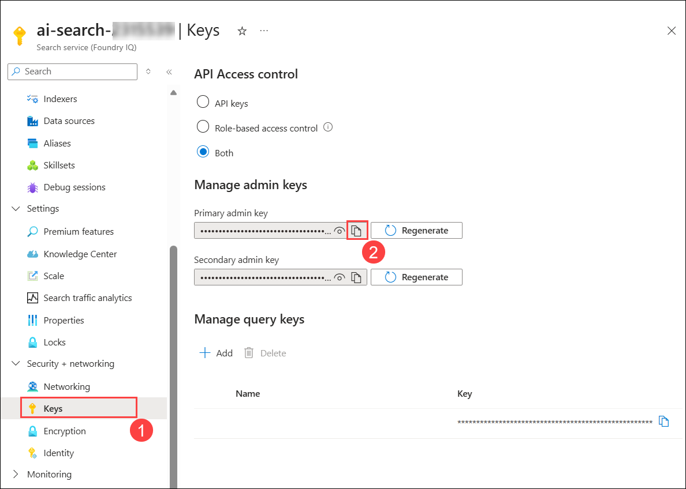

> **Congratulations** on completing the task! Now, it's time to validate it. Here are the steps:

- Hit the Validate button for the corresponding task. If you receive a success message, you can proceed to the next task. 
- If not, carefully read the error message and retry the step, following the instructions in the lab guide.
- If you need any assistance, please contact us at cloudlabs-support@spektrasystems.com. We are available 24/7 to help you out.

<validation step="3497b745-b26b-47e6-bfbf-fdb7f238faa4" />  

## Task 2: Create a Semantic Search Plugin to query the AI Search Index

In this task, you will explore different flow types in Azure AI Foundry by creating a Semantic Search Plugin to query the AI Search Index for enhanced retrieval capabilities.

<details>
<summary><strong>Python</strong></summary>

1. Navigate to `Python>src` directory and open **.env (1)** file.

     

1. Paste the **AI search URL** that you copied earlier in the exercise besides `AI_SEARCH_URL` in **.env** file.

     > **Note:** Ensure that every value in the **.env** file is enclosed in **double quotes (")**.

1. Paste the **Primary admin key** that you copied earlier in the exercise besides `AI_SEARCH_KEY`.

     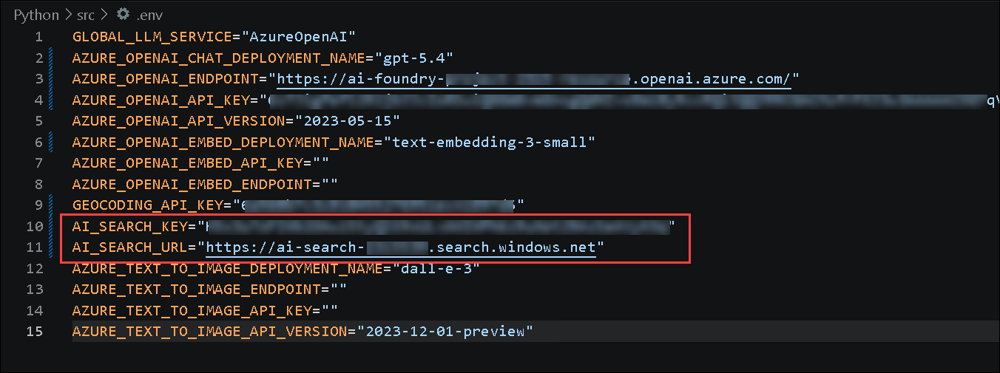

1. Save the file.

1. Navigate to `Python>src>plugins` directory and create a new file named **ContosoSearchPlugin.py (1)**.

     

1. Add the following code to the file:

     ```
     import json
     import os
     from typing import Annotated, Dict, List, Any

     import requests
     from azure.core.credentials import AzureKeyCredential
     from azure.search.documents.indexes import SearchIndexClient
     from azure.search.documents.models import VectorizedQuery
     from dotenv import load_dotenv
     from semantic_kernel.functions import kernel_function

     class ContosoSearchPlugin:
         def __init__(self):
             load_dotenv()

             self.openai_endpoint = os.getenv("AZURE_OPENAI_ENDPOINT")
             self.openai_api_key = os.getenv("AZURE_OPENAI_API_KEY")
             self.embedding_deployment = os.getenv("AZURE_OPENAI_EMBED_DEPLOYMENT_NAME")
             self.embedding_api_version = os.getenv("AZURE_OPENAI_API_VERSION", "2023-05-15")

             self.search_endpoint = os.getenv("AI_SEARCH_URL")
             self.search_key = os.getenv("AI_SEARCH_KEY")

             self.index_client = SearchIndexClient(
                 endpoint=self.search_endpoint,
                 credential=AzureKeyCredential(self.search_key)
             )
             self._handbook_index_name = None

         def generate_embedding(self, text: str) -> List[float]:
             if not text:
                 raise ValueError("Input text cannot be empty")

             url = f"{self.openai_endpoint}/openai/deployments/{self.embedding_deployment}/embeddings?api-version={self.embedding_api_version}"
             headers = {
                 "Content-Type": "application/json",
                 "api-key": self.openai_api_key
             }
             payload = {
                 "input": text,
                 "dimensions": 1536  # Standard for text-embedding-ada-002
             }

             try:
                 response = requests.post(url, headers=headers, json=payload)
                 response.raise_for_status()
                 embedding_data = response.json()
                 return embedding_data["data"][0]["embedding"]
             except Exception as e:
                 raise Exception(f"Failed to generate embedding: {str(e)}")

         def _get_handbook_index_name(self) -> str:
             if self._handbook_index_name:
                 return self._handbook_index_name

             for index in self.index_client.list_indexes():
                 candidate_client = self.index_client.get_search_client(index.name)
                 probe = candidate_client.search(search_text="*", select=["metadata_storage_path"], top=1)
                 for doc in probe:
                     path = doc.get("metadata_storage_path", "")
                     if path and "handbook" in path.lower():
                         self._handbook_index_name = index.name
                         return self._handbook_index_name

             raise ValueError("No Azure AI Search index containing the employee handbook was found on this search service.")

         def search_documents(self, query: str, top: int = 3) -> List[Dict[str, Any]]:
             try:
                 # Generate embedding for the query
                 query_embedding = self.generate_embedding(query)

                 # Create a vectorized query
                 vector_query = VectorizedQuery(
                     vector=query_embedding,
                     k_nearest_neighbors=top,
                     fields="snippet_vector"
                 )

                 # Execute the search against the discovered handbook index
                 search_client = self.index_client.get_search_client(self._get_handbook_index_name())
                 results = search_client.search(
                     search_text=query,  # Also include text search for hybrid retrieval
                     vector_queries=[vector_query],
                     select=["snippet", "metadata_storage_path"],
                     top=top
                 )

                 # Format the results
                 search_results = []
                 for result in results:
                     search_results.append({
                         "content": result.get("snippet", ""),
                         "title": result.get("metadata_storage_path", "Unknown"),
                         "score": result["@search.score"]
                     })

                 return search_results

             except Exception as e:
                 raise Exception(f"Search failed: {str(e)}")

         @kernel_function(description="Searches the Contoso employee handbook for policy and process information (e.g. vacation policy, performance reviews, benefits).")
         def query_handbook(
             self,
             query: Annotated[str, "The question or topic to look up in the Contoso employee handbook"],
             top: Annotated[int, "Number of top matching results to return"] = 3,
         ) -> str:
             try:
                 results = self.search_documents(query, top)

                 # Format the results into a nice response
                 if not results:
                     return "No relevant information found in the Contoso Handbook."

                 response = f"Here's what I found in the Contoso Handbook about '{query}':\n\n"
                 for i, result in enumerate(results, 1):
                     response += f"Result {i} (Source: {result['title']}):\n{result['content']}\n\n"

                 return response

             except Exception as e:
                 return f"Error querying the Contoso Handbook: {str(e)}"

     if __name__ == "__main__":
         search_plugin = ContosoSearchPlugin()
         query = "What is Contoso's vacation policy?"
         result = search_plugin.query_handbook(query)
         print(result)
     ```

1. Save the file.

1. Navigate to `Python>src` directory and open **chat.py (1)** file.

      

1. Add the following code in the `#Import Modules` section of the file.

      ```
      from semantic_kernel.connectors.ai.open_ai import AzureTextEmbedding
      from plugins.ContosoSearchPlugin import ContosoSearchPlugin
      ```

      

1. Add the following code in the `#Challenge 05 - Add Text Embedding service for semantic search` section of the file.

      ```
      text_embedding_service = AzureTextEmbedding(
          deployment_name=os.getenv("AZURE_OPENAI_EMBED_DEPLOYMENT_NAME"),
          api_key=os.getenv("AZURE_OPENAI_API_KEY"),
          endpoint=os.getenv("AZURE_OPENAI_ENDPOINT"),
          service_id="embedding-service"
      )
      kernel.add_service(text_embedding_service)
      logger.info("Text Embedding service added")
      ```

      

      > **Note**: Please refer the screenshots to locate the code in proper position that helps you to avoid indentation error.

1. Add the following code in the `# Challenge 05 - Add Search Plugin` section of the file.

      ```
      kernel.add_plugin(
          ContosoSearchPlugin(),
          plugin_name="ContosoSearch",
      )
      logger.info("Contoso Handbook Search plugin loaded")
      ```

      

      > **Note**: Please refer the screenshots to locate the code in proper position that helps you to avoid indentation error.    

1. In case you encounter any indentation error, use the code from the following URL:

      ```
      https://raw.githubusercontent.com/CloudLabsAI-Azure/ai-developer/refs/heads/guided-labs/CodeBase/python/lab-05.py
      ```

1. Save the file.

1. Right click on `Python>src` **(1)** in the left pane and select **Open in Integrated Terminal (2)**.

     

1. Use the following command to run the app:

      ```
      streamlit run app.py
      ```

1. If the app does not open automatically in the browser, you can access it using the following **URL**:

      ```
      http://localhost:8501
      ```

1. Submit the following prompt and see how the AI responds:

      ```
      What are the steps for the Contoso Performance Reviews?
      ```

      ```
      What is Contoso's policy on Data Security?
      ```

      ```
      Who do I contact at Contoso for questions regarding workplace safety?
      ```

1. You will receive a response similar to the one shown below:

      

      

      

</details>

<details>
<summary><strong>C Sharp(C#)</strong></summary>

1. Navigate to `Dotnet>src>BlazorAI` directory and open **appsettings.json (1)** file.

      

1. Paste the **AI search URL** that you copied earlier in the exercise besides `AI_SEARCH_URL` in **appsettings.json** file.

      > **Note:** Ensure that every value in the **appsettings.json** file is enclosed in **double quotes (")**.

1. Paste the **Primary admin key (1)** that you copied earlier in the exercise besides `AI_SEARCH_KEY` **(2)**.

      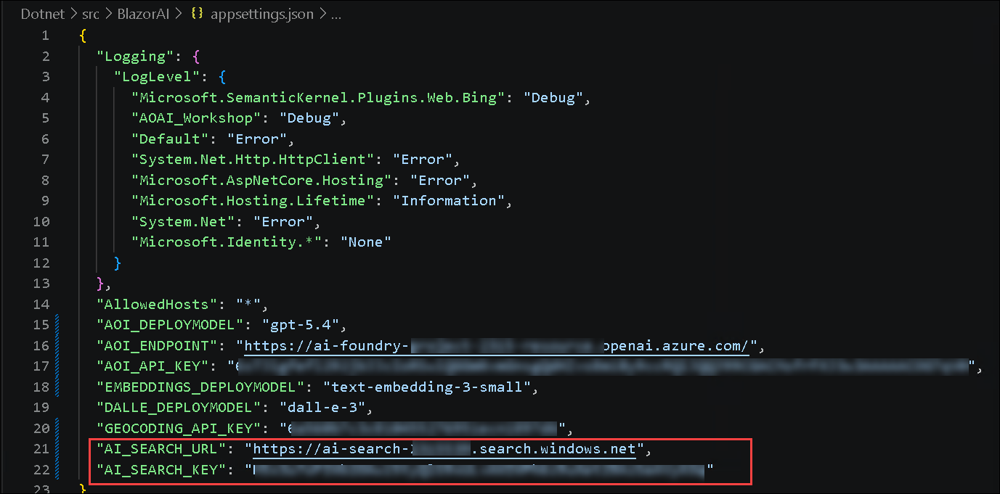

1. Save the file.

1. Navigate to `Dotnet>src>BlazorAI>Plugins` directory and create a new file named **ContosoSearchPlugin.cs (1)**.

      

1. Add the following code to the file:

   ```csharp
   using System.ComponentModel;
   using System.Text;
   using System.Text.Json.Serialization;
   using Azure;
   using Azure.Search.Documents;
   using Azure.Search.Documents.Indexes;
   using Azure.Search.Documents.Indexes.Models;
   using Azure.Search.Documents.Models;
   using Microsoft.SemanticKernel;
   using Microsoft.SemanticKernel.Embeddings;

   namespace BlazorAI.Plugins
   {
       public class ContosoSearchPlugin
       {
           private readonly ITextEmbeddingGenerationService _textEmbeddingGenerationService;
           private readonly SearchIndexClient _indexClient;
           private string? _handbookIndexName;

           public ContosoSearchPlugin(IConfiguration configuration)
           {
               // Create the search index client
               _indexClient = new SearchIndexClient(
                   new Uri(configuration["AI_SEARCH_URL"]),
                   new AzureKeyCredential(configuration["AI_SEARCH_KEY"]));

               // Get the embedding service from the kernel
               var kernelBuilder = Kernel.CreateBuilder();

               kernelBuilder.AddAzureOpenAITextEmbeddingGeneration(
                   configuration["EMBEDDINGS_DEPLOYMODEL"],
                   configuration["AOI_ENDPOINT"],
                   configuration["AOI_API_KEY"]);

               var kernel = kernelBuilder.Build();

               _textEmbeddingGenerationService =
                   kernel.GetRequiredService<ITextEmbeddingGenerationService>();
           }

           [KernelFunction("SearchHandbook")]
           [Description("Searches the Contoso employee handbook for information about company policies, benefits, procedures, or other employee-related questions. Use this when the user asks about company policies, employee benefits, work procedures, or any information that might be in an employee handbook.")]
           public async Task<string> Search(
               [Description("The user's question about company policies, benefits, procedures or other handbook-related information")]
               string query)
           {
               try
               {
                   // Convert string query to vector embedding
                   ReadOnlyMemory<float> embedding =
                       await _textEmbeddingGenerationService.GenerateEmbeddingAsync(query);

                   // Get client for search operations
                   string indexName = await GetHandbookIndexNameAsync();
                   SearchClient searchClient = _indexClient.GetSearchClient(indexName);

                   // Configure request parameters
                   VectorizedQuery vectorQuery = new(embedding);
                   vectorQuery.Fields.Add("snippet_vector");
                   vectorQuery.KNearestNeighborsCount = 3;

                   SearchOptions searchOptions = new()
                   {
                       VectorSearch = new()
                       {
                           Queries = { vectorQuery }
                       },
                       Size = 3
                   };

                   // Perform search request
                   Response<SearchResults<IndexSchema>> response =
                       await searchClient.SearchAsync<IndexSchema>(searchOptions);

                   // Collect search results
                   StringBuilder results = new();

                   await foreach (SearchResult<IndexSchema> result in response.Value.GetResultsAsync())
                   {
                       if (!string.IsNullOrEmpty(result.Document.Content))
                       {
                           results.AppendLine($"Source: {result.Document.Title}");
                           results.AppendLine($"Content: {result.Document.Content}");
                           results.AppendLine();
                       }
                   }

                   return results.Length > 0
                       ? results.ToString()
                       : "No relevant information found in the employee handbook.";
               }
               catch (Exception ex)
               {
                   return $"Search error: {ex.Message}";
               }
           }

           private async Task<string> GetHandbookIndexNameAsync()
           {
               if (_handbookIndexName != null)
               {
                   return _handbookIndexName;
               }

               await foreach (SearchIndex index in _indexClient.GetIndexesAsync())
               {
                   SearchClient candidateClient = _indexClient.GetSearchClient(index.Name);

                   SearchOptions probeOptions = new()
                   {
                       Size = 1
                   };

                   probeOptions.Select.Add("metadata_storage_path");

                   Response<SearchResults<SearchDocument>> probe =
                       await candidateClient.SearchAsync<SearchDocument>("*", probeOptions);

                   await foreach (SearchResult<SearchDocument> doc in probe.Value.GetResultsAsync())
                   {
                       if (doc.Document.TryGetValue("metadata_storage_path", out object? path) &&
                           path?.ToString().Contains("handbook", StringComparison.OrdinalIgnoreCase) == true)
                       {
                           _handbookIndexName = index.Name;
                           return _handbookIndexName;
                       }
                   }
               }

               throw new InvalidOperationException(
                   "No Azure AI Search index containing the employee handbook was found on this search service.");
           }

           private sealed class IndexSchema
           {
               [JsonPropertyName("snippet")]
               public string Content { get; set; }

               [JsonPropertyName("metadata_storage_path")]
               public string Title { get; set; }
           }
       }
   }
   ```

1. Save the file.

1. Navigate to `Dotnet>src>BlazorAI>Components>Pages` directory and open **Chat.razor.cs (1)** file.

      

1. Add the following code in the `// Import Models` section of the file.

     ```
     using Microsoft.SemanticKernel.Connectors.AzureAISearch;
     using Azure;
     using Azure.Search.Documents.Indexes;
     using Microsoft.Extensions.DependencyInjection;
     ```

      

1. Add the following code in the `// Challenge 05 - Register Azure AI Foundry Text Embeddings Generation` section of the file.

     ```
     kernelBuilder.AddAzureOpenAITextEmbeddingGeneration(
         Configuration["EMBEDDINGS_DEPLOYMODEL"]!,
         Configuration["AOI_ENDPOINT"]!,
         Configuration["AOI_API_KEY"]!);
     ```

      

      > **Note**: Please refer the screenshots to locate the code in proper position that helps you to avoid indentation error.

1. Add the following code in the `// Challenge 05 - Register Search Index` section of the file.

     ```
     kernelBuilder.Services.AddSingleton<SearchIndexClient>(sp => 
         new SearchIndexClient(
             new Uri(Configuration["AI_SEARCH_URL"]!), 
             new AzureKeyCredential(Configuration["AI_SEARCH_KEY"]!)
         )
     );

     kernelBuilder.Services.AddSingleton<AzureAISearchVectorStoreRecordCollection<Dictionary<string, object>>>(sp =>
     {
         var searchIndexClient = sp.GetRequiredService<SearchIndexClient>();
         return new AzureAISearchVectorStoreRecordCollection<Dictionary<string, object>>(
             searchIndexClient,
             "employeehandbook"
         );
     });

     kernelBuilder.AddAzureAISearchVectorStore();
     ```

      

      > **Note**: Please refer the screenshots to locate the code in proper position that helps you to avoid indentation error.

1. Add the following code in the `// Challenge 05 - Add Search Plugin` section of the file.

     ```
     var searchPlugin = new ContosoSearchPlugin(Configuration);
     kernel.ImportPluginFromObject(searchPlugin, "HandbookPlugin");
     ```

      

1. In case you encounter any indentation error, use the code from the following URL:

     ```
     https://raw.githubusercontent.com/CloudLabsAI-Azure/ai-developer/refs/heads/guided-labs/CodeBase/c%23/lab-05.cs
     ```
1. Save the file.

1. Right-click on `Dotnet>src>Aspire>Aspire.AppHost` **(1)** in the left pane and select **Open in Integrated Terminal (2)**.

      

1. Use the following command to run the app:

     ```
     dotnet run
     ```

1. Open a new tab in the browser and navigate to the link for **blazor-aichat**
     ```
     https://localhost:7118/
     ```

1. Submit the following prompt and see how the AI responds:

     ```
     What are the steps for the Contoso Performance Reviews?
     ```
     ```
     What is Contoso's policy on Data Security?
     ```
     ```
     Who do I contact at Contoso for questions regarding workplace safety?
     ```

1. You will receive a response similar to the one shown below:

      

      

      

1. Once you receive the response, navigate back to the Visual studio code terminal and then press **Ctrl+C** to stop the build process.

</details>

## Review

In this exercise, we explored the **Retrieval-Augmented Generation (RAG) pattern** to enhance AI responses by integrating external knowledge into the generative process. We examined how retrieval mechanisms work alongside generative models to produce accurate, context-aware outputs. This enhanced our proficiency in building secure, knowledge-enriched AI solutions using the RAG architecture.

You have successfully completed the below tasks for **Retrieval-Augmented Generation (RAG) implementation**:  

- Integrated the **RAG pattern** to enhance AI-generated responses with external knowledge retrieval.  
- Utilized **Azure AI Search** to fetch relevant contextual data for more accurate outputs.  
- Configured **Semantic Kernel** to orchestrate retrieval and generative workflows seamlessly.  

## Go to the next lab by clicking on the navigation.
