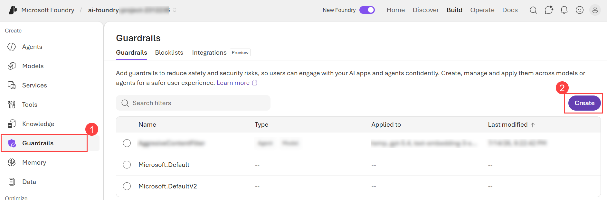
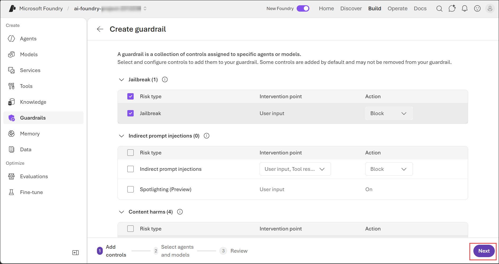
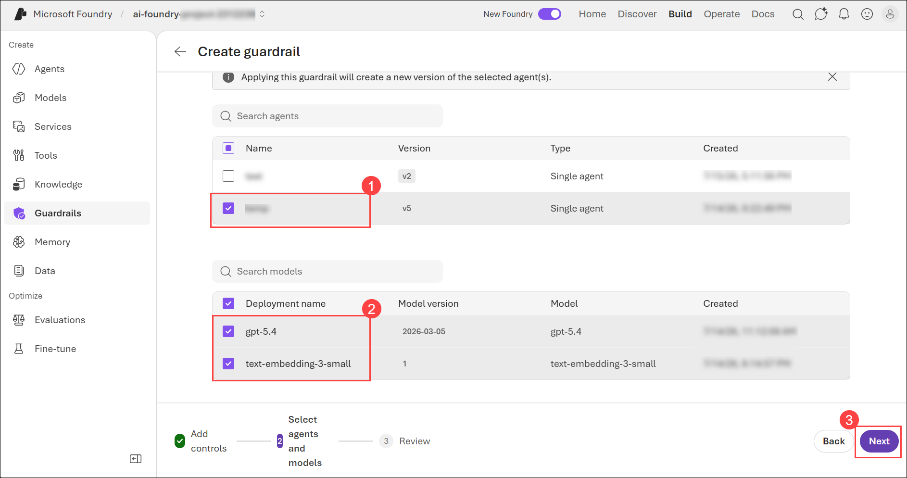
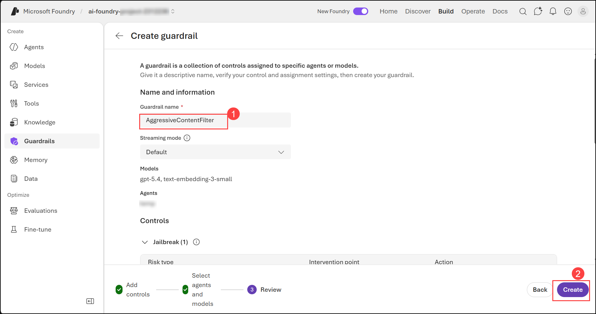
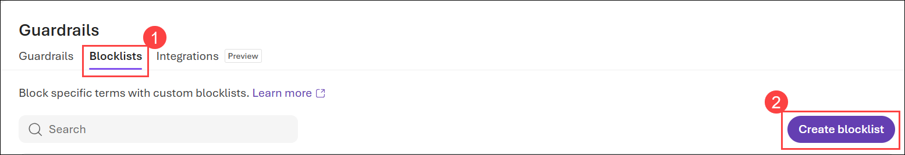
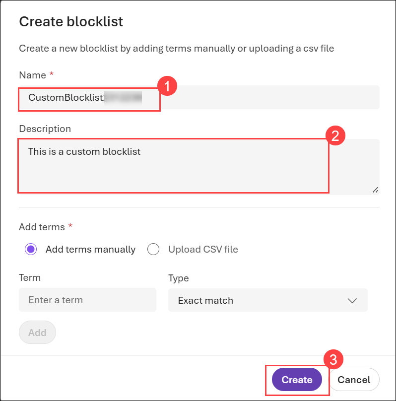
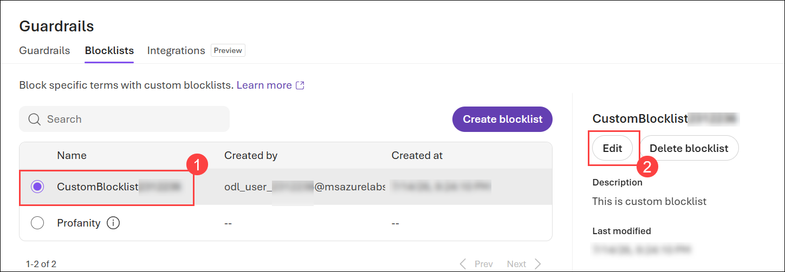
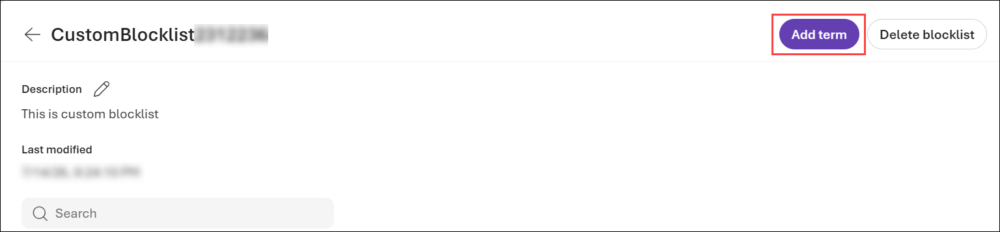
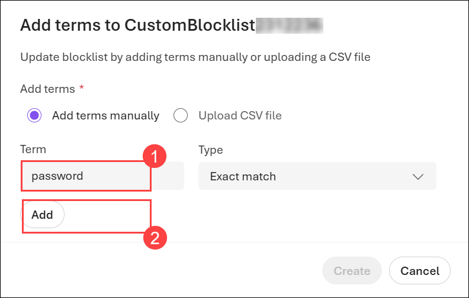
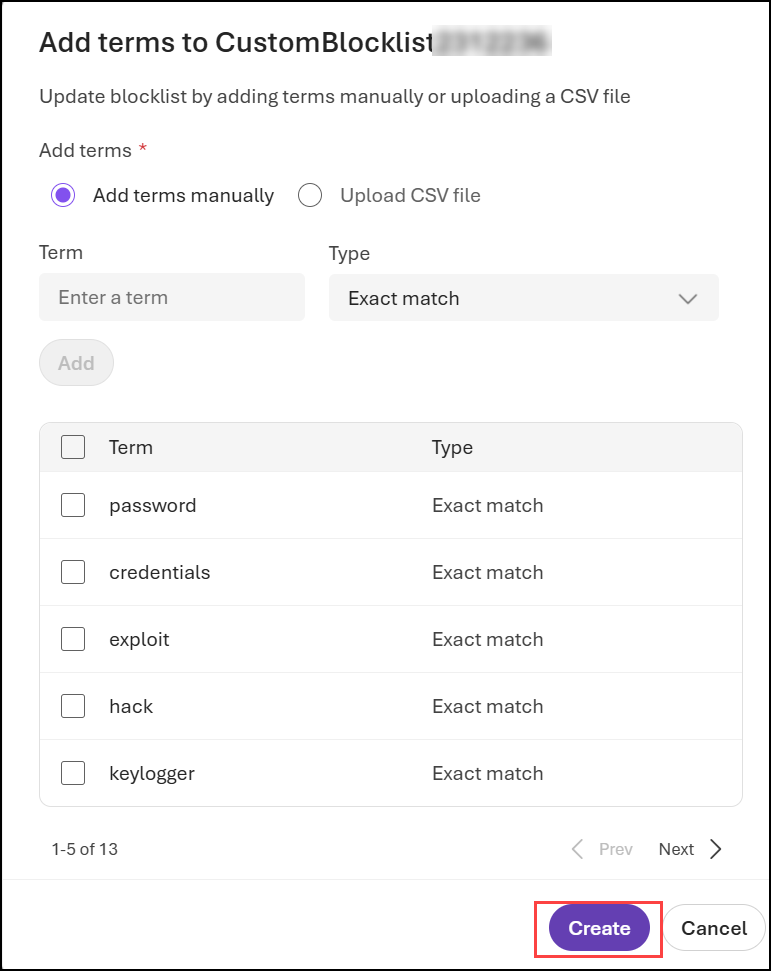

# Exercise 6: Responsible AI: Exploring Content Filters in Azure AI Foundry
### Estimated Duration: 25 Minutes

This hands-on lab introduces content filtering in Azure AI Foundry to help you build safer, more responsible AI applications.
You will learn to apply built-in filters, adjust settings, and create custom rules to block unwanted content—all within Azure AI Foundry Studio.

## Objectives
In this exercise, you will be performing the following tasks:
- Task 1: Adjust Filter Settings
- Task 2: Filter specific words or patterns

## Task 1: Adjust Filter Settings

In this task, you will explore different flow types in Azure AI Foundry by adjusting filter settings to refine search results and improve query accuracy.

1. Navigate back to the **Microsoft Foundry** portal.

1. From the left navigation pane, click on **Guardrails (1)** and then click **Create (2)**.

    

1. On the **Create guardrail** screen, leave all configuration as default and click **Next**.

     

1. Now, select the **Agents (1)** and **Models (2)**, and click **Next (3)**

    

1. On the review screen, enter the **Guardrail name (1)** as **AggressiveContentFilter**, then review your models and agents and click **Create (2)**

    

## Task 2: Filter specific words or patterns

In this task, you will explore different flow types in Azure AI Foundry by filtering specific words or patterns to refine search results and enhance data relevance.

1. Navigate to **Blocklists (1)** tab and then click **Create blocklist (2)**.

    
    
1. On the **Create blocklist** blade, specify the following configuration options and click on **Create (3)**:

    - **Name**:  **CustomBlocklist<inject key="Deployment ID" enableCopy="false"></inject> (1)**
    - **Description**: This is a custom blocklist. **(2)**

      

1. Select the **CustomBlocklist<inject key="Deployment ID" enableCopy="false"></inject> (1)** created earlier and click **Edit (2)**

      

1. On the Custom Blocklist screen, click on **Add term**.

    

1. On Add terms blade, Enter term as  **password (1)** and then click **Add (2)**, make sure the Type should be Exact match. 

       

1. Repeat the step for the following:-

    - credentials
    - exploit
    - hack
    - keylogger
    - phishing
    - SSN
    - credit card
    - bank account
    - CVV
    - casino
    - poker
    - betting

1. Once all terms are added click on **Create**.

      
 

## Review

In this exercise, we explored **content filtering** in **Azure AI Foundry** to support the development of safer and more responsible AI applications. We applied built-in filters, adjusted content moderation settings, and created custom rules to block unwanted content within Azure AI Foundry Studio. This enhanced our proficiency in implementing ethical and secure AI solutions.

You have successfully completed the below tasks for **content filtering in Azure AI Foundry**:  

- Implemented **Azure AI Content Safety** to ensure responsible AI interactions.  
- Applied **built-in content filters** to block harmful or inappropriate responses.  
- Configured **custom content moderation rules** within **Azure AI Foundry Studio**.  
- Adjusted **content filtering settings** to align with ethical AI guidelines.  

## Go to the next lab by clicking on the navigation.
