# Exercise 7: Multi-Agent Systems

### Estimated Duration: 30 Minutes

## Overview

In this exercise, you will gain hands-on experience building a multi-agent chat system using the **Semantic Kernel** framework integrated with the **Microsoft Foundry GPT-4o** model. This lab introduces multi-agent system development, where a user request is processed by multiple agents, each with a distinct persona and responsibility. Designed for those new to AI driven automation, the lab guides you through integrating agents that collaborate to generate a well-rounded response. Whether handling specialized tasks or combining expertise, this system ensures comprehensive context-aware outputs. By the end of this lab, you will understand how to orchestrate multi-agent interactions to enhance AI-driven decision-making and user experiences.

## Objective

In this exercise, you will complete the following task:

- Task 1: Create a Multi-agent chat system

## Task 1: Create a Multi-agent chat system

In this task, you will explore different flow types in Microsoft Foundry by creating a Multi-Agent Chat System to enable collaborative AI interactions.

<details>
<summary><strong>Python</strong></summary>

1. Navigate to `Python>src` directory and open **multi_agent.py** file.

    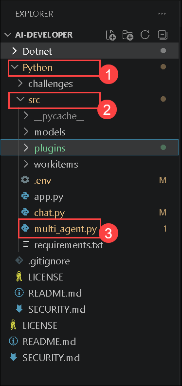

1. Remove the existing code and add the code from the following URL in the file.
    ```
    https://raw.githubusercontent.com/CloudLabsAI-Azure/ai-developer/refs/heads/prod/CodeBase/python/lab-08.py
    ```
1. Save the file.

1. Right click on `Python>src>workitems` **(1)** in the left pane and select **Open in Integrated Terminal (2)**.

    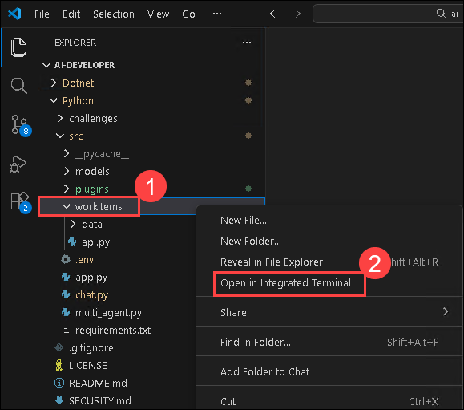

1. Use the following command to run the app:
    ```
    python api.py
    ```
    >**Note**:- Please don't close the `terminal`.

1. Now, right-click on `Python>src` **(1)** in the left pane and select **Open in Integrated Terminal (2)**.

    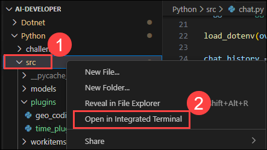

1. Use the following command to run the app:
    ```
    streamlit run app.py
    ```
1. If the app does not open automatically in the browser, you can access it using the following **URL**:
    ```
    http://localhost:8501
    ```
1. Select **Multi-Agent** on the left-hand side pane.

    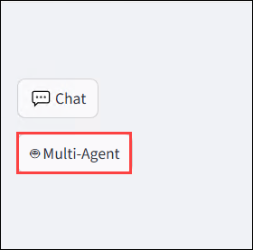

1. Submit the following prompt and see how the AI responds:
    ```
    Build a Calculator app.
    ```
1. You will receive a response similar to the one shown below:

    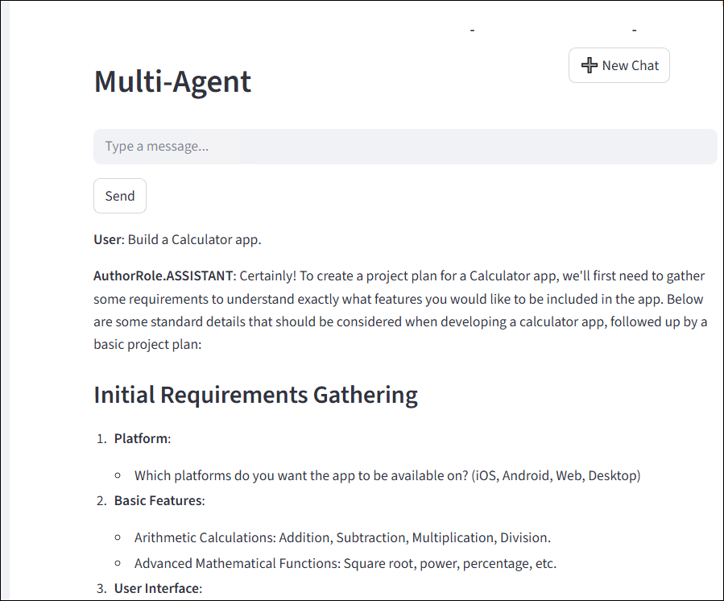
    
    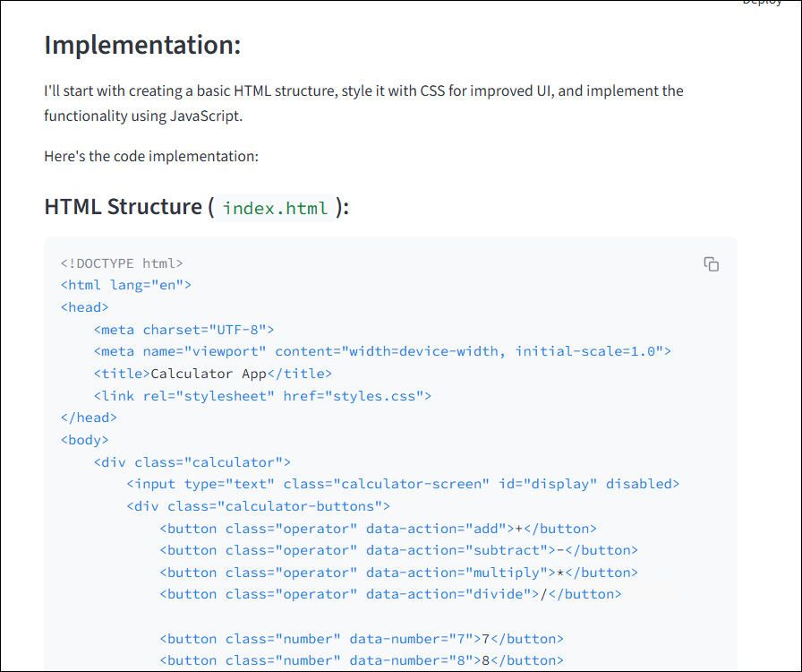

</details>

<details>
<summary><strong>C Sharp(C#)</strong></summary>

1. Navigate to `Dotnet>src>BlazorAI>Components>Pages` directory and open **MultiAgent.razor.cs** file.

    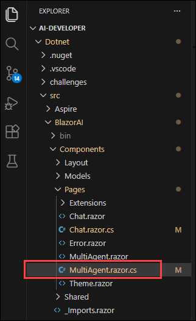

1. Remove the existing code and add the code from the following URL in the file.
    ```
    https://raw.githubusercontent.com/CloudLabsAI-Azure/ai-developer/refs/heads/prod/CodeBase/c%23/lab-08.cs
    ```
1. Save the file.

1. Right click on `Dotnet>src>Aspire>Aspire.AppHost` **(1)** in the left pane and select **Open in Integrated Terminal (2)**.

    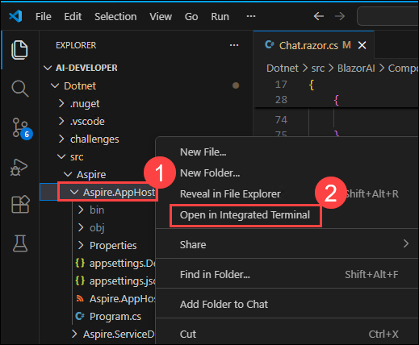

1. Use the following command to run the app:
    ```
    dotnet run
    ```
1. Open a new tab in the browser and navigate to the below link for **blazor-aichat**

    ```
    https://localhost:7118/
    ```

    >**Note**: If you receive security warnings in the browser, close the browser and follow the link again.

1. Select **Multi-Agent** on the left-hand side pane.

    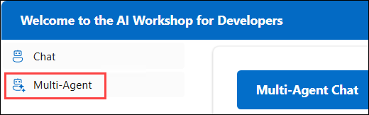

1. Submit the following prompt and see how the AI responds:
    ```
    Build a Calculator app.
    ```
1. You will receive a response similar to the one shown below:

    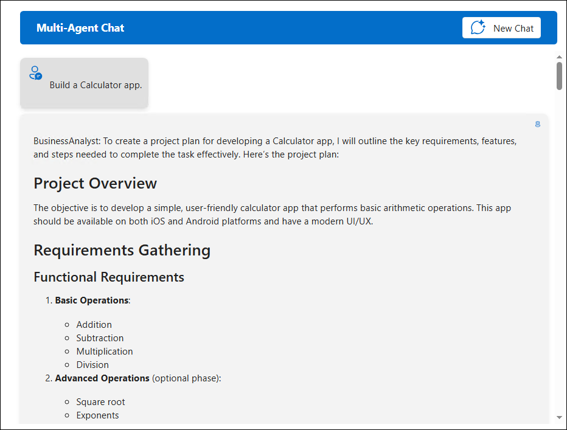

    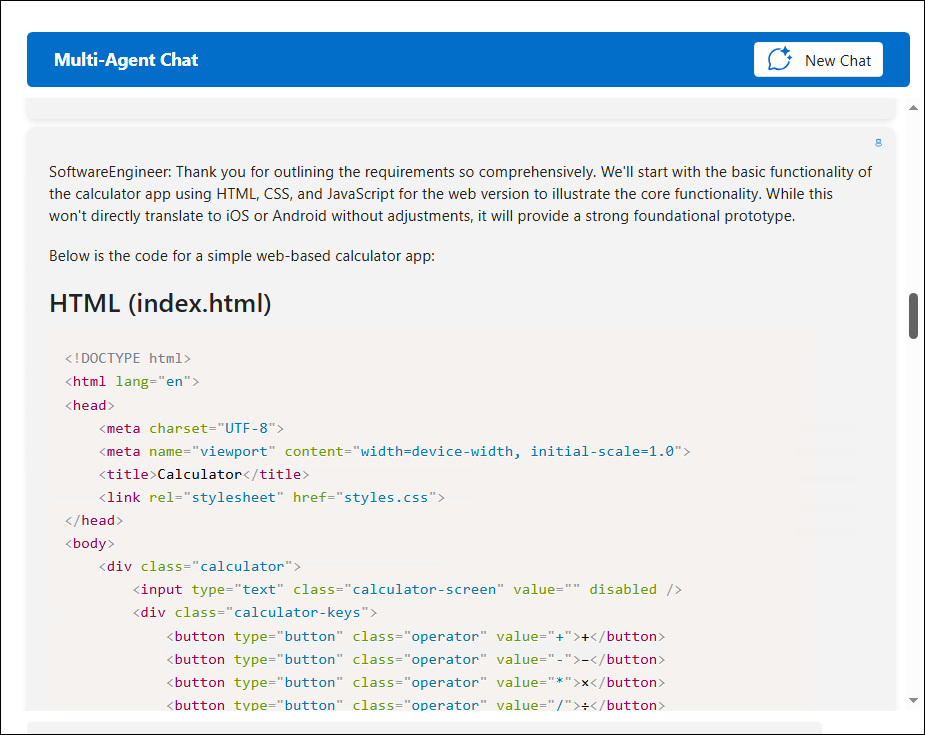

</details>

## Summary

In this exercise, you have completed the following:

- Created a multi-agent chat system.

## You have successfully completed the Hands-on lab.

By completing the **AI Developer - Azure AI Foundry and Semantic Kernel Fundamentals** lab, you gained practical experience in building and extending AI applications using Microsoft Foundry and Semantic Kernel. You set up core Azure AI services, configured the application environment, and deployed models such as gpt, text embeddings and DALL-E. You also created and integrated multiple Semantic Kernel plugins for real-time data access, semantic search, external APIs, and image generation, applied content filtering controls, and implemented a multi-agent chat system
